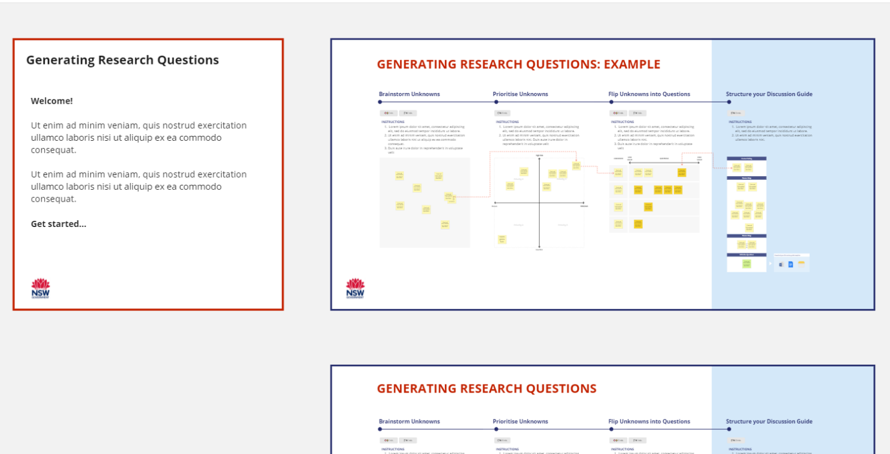

<nav aria-label="Breadcrumb" class="nsw-breadcrumb">
    <ol class="nsw-breadcrumb__list">
        <li class="nsw-breadcrumb__item">
            <a href="#" class="nsw-breadcrumb__link " >Home</a>
        </li>
        <li class="nsw-breadcrumb__item">
            <a href="#" class="nsw-breadcrumb__link " >Digital Service Toolkit</a>
        </li>
        <li class="nsw-breadcrumb__item">
            <a href="#" class="nsw-breadcrumb__link nsw-breadcrumb--current" aria-current="page">Team activities</a>
        </li>
    </ol>
</nav>

    

        

            <h1>Generating research questions</h1>
            
Ready to learn from your customers? Generate high-value questions based on the most critical aspects of your project.

        

    

    

        

            
            
By Website Consolidation, NSW.Gov.au

            
 [Preview] [Use] [Share] 

        

        

            
Projects are full of unknowns when you start. By calling them out early and prioritising the ones with the biggest risk you your project, you can decide what you need to know first, and what can wait until later. 

            
Stay on strategy: 

            

                When you turn unknowns about your customers into things you know for certain, you’re improving your chances of building the right solution to your users problem.
            

        

        

            

                

                    <h4 class="nsw-callout__title">Who is this for</h4>
                    
This is for <strong>teams or individuals</strong> who want to understand a challenge from the perspective of customers.
                    

                    <h4>What you'll get</h4>
                    <ul>
                        <li>
                            ✔ Instructions
                        </li>
                        <li>✔ Pro-tips
                        </li>
                        <li>✔ Examples
                        </li>
                        <li>✔ Walk through video
                        </li>
                    </ul>
                    
Use this:

                    
Before the project starts to understand the scope of your research

                    
During the project whenever you need to learn more from customer

                    
After the project to evaluate how your solution

                

            

        

        

            

<a href="#">

<svg xmlns="http://www.w3.org/2000/svg" viewBox="0 0 311.69 311.69"><path d="M155.84,0A155.85,155.85,0,1,0,311.69,155.84,155.84,155.84,0,0,0,155.84,0Zm0,296.42A140.58,140.58,0,1,1,296.42,155.84,140.58,140.58,0,0,1,155.84,296.42Z"></path><polygon points="218.79 155.84 119.22 94.34 119.22 217.34 218.79 155.84"></polygon></svg>

</a>

[Video walkthrough]

        

        

            <h2>Helpful activities to do before</h2>
            
<a href="#">Project kick-off canvas</a>

        

        

            <h2>Helpful activities to do next</h2>
            
<a href="#">Recruitment Brainstorming</a>

        

    

